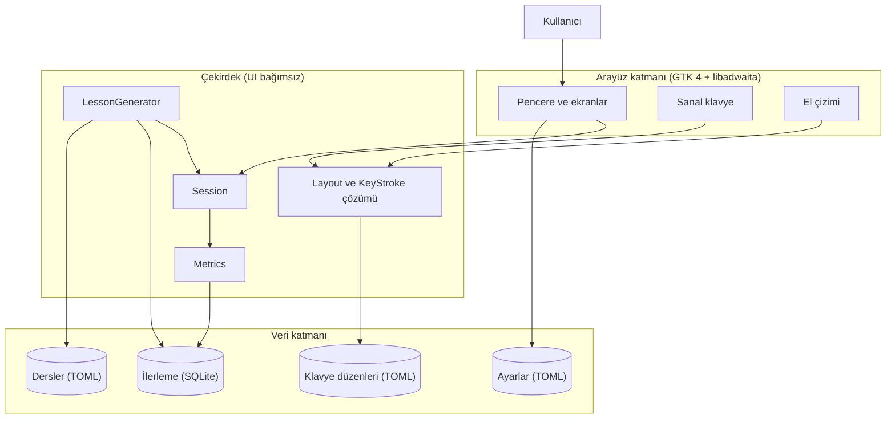
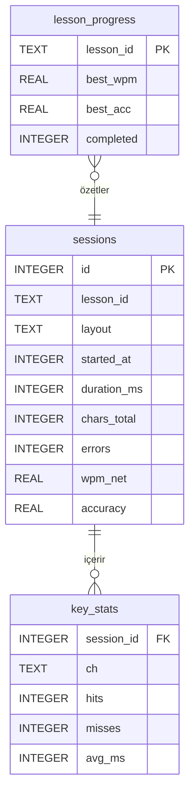
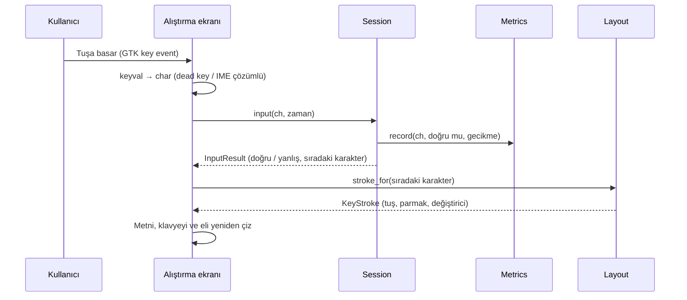
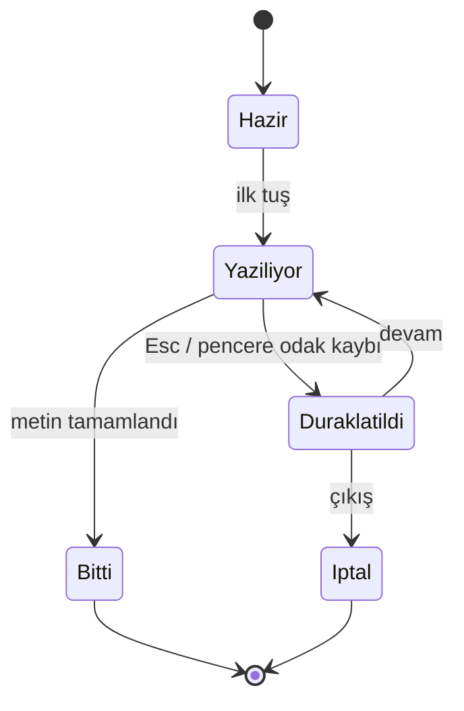

# Homerow (çalışma adı) — Blueprint

- **Durum:** Taslak
- **Sürüm:** 0.1
- **Tarih:** 07.10.2026
- **Kapsam:** Linux masaüstü için 10 parmak klavye alıştırması uygulamasının amacı, özellikleri ve temel mimarisi

## 1. Özet

Homerow, Linux masaüstünde 10 parmak (dokunarak) klavye kullanımını öğreten, sade bir masaüstü uygulamasıdır. Kullanıcı derslerle ana sıradan başlayıp tüm klavyeye ilerler; uygulama her karakter için **hangi elin hangi parmağıyla** basılacağını sanal klavye ve el çizimi üzerinde gösterir. Uygulama Rust ile, GTK 4 + libadwaita arayüzüyle yazılır ve üç katmandan oluşur: arayüz, arayüzden bağımsız çekirdek (oturum, ölçüm, ders üretimi) ve veri katmanı. Dersler ve klavye düzenleri TOML dosyalarında, kullanıcı ilerlemesi yerel bir SQLite veritabanında tutulur. Uygulama tamamen çevrimdışı çalışır.

## 2. Bağlam ve problem

10 parmak yazmayı öğrenmenin temeli doğru parmak alışkanlığıdır; yanlış parmakla hızlanan biri sonradan bu alışkanlığı bırakmakta zorlanır. Linux'ta KTouch ve Klavaro gibi araçlar var, ancak bu proje şu üç noktaya odaklanır:

- Türkçe Q ve Türkçe F düzenlerini birinci sınıf destekleyen,
- her tuşta parmağı ve karşı el Shift / AltGr kuralını açıkça gösteren,
- zayıf tuşları ve zayıf parmakları tespit edip alıştırmayı ona göre üreten,

basit, modern görünümlü bir GNOME uygulaması.

**Hedef kullanıcılar:** Klavyeye bakmadan yazmayı öğrenmek isteyen Linux kullanıcıları (öğrenciler, yazılımcılar, ofis çalışanları). Tek kullanıcılı, yerel kullanım.

## 3. Hedefler ve kapsam dışı

**Hedefler**

- [H-1] Kullanıcıya her karakter için doğru tuşu, doğru eli ve doğru parmağı göstererek doğru parmak alışkanlığı kazandırmak.
- [H-2] Kademeli derslerle ana sıradan tüm klavyeye ilerlemeyi sağlamak.
- [H-3] Hız (WPM), doğruluk, tuş ve parmak bazlı istatistiklerle ilerlemeyi görünür kılmak.
- [H-4] Zayıf tuşlara yönelik otomatik alıştırma üretmek.
- [H-5] Yeni klavye düzeni ve ders eklemeyi kod değiştirmeden, yalnızca veri dosyasıyla mümkün kılmak.

**Kapsam dışı**

- Çok kullanıcılı hesaplar, bulut senkronizasyonu, çevrimiçi sıralama tabloları.
- Windows ve macOS desteği (mimari engel olmaz, ancak hedeflenmez).
- Oyunlaştırılmış mini oyunlar (ileride genişleme noktası olarak düşünülebilir).
- Klavye donanımını doğrudan okuma (evdev); giriş yalnızca masaüstü ortamı üzerinden alınır.

## 4. Gereksinimler

### 4.1 Fonksiyonel gereksinimler

- [FG-1] Kullanıcı bir klavye düzeni seçer (Türkçe Q, Türkçe F, US).
- [FG-2] Kullanıcı ders listesinden bir ders seçer; dersler sırayla açılır (eşik: hedef WPM ve doğruluk).
- [FG-3] Alıştırma ekranında hedef metin gösterilir; doğru karakterler yeşil, yanlışlar kırmızı, imleç vurgulu görünür.
- [FG-4] Sıradaki karakter için sanal klavyede tuş, el çiziminde parmak vurgulanır.
- [FG-5] Karakter Shift veya AltGr gerektiriyorsa değiştirici tuş ve ona basacak parmak da vurgulanır (karşı el Shift kuralı; AltGr sağ başparmak).
- [FG-6] Sanal klavyedeki her tuş, sorumlu parmağın rengiyle soluk olarak boyanır.
- [FG-7] Oturum sonunda net WPM, doğruluk, hatalı tuşlar ve süre gösterilir.
- [FG-8] İstatistik ekranında zaman içindeki WPM/doğruluk gelişimi, en zayıf tuşlar ve en zayıf parmaklar görülür.
- [FG-9] "Zayıf tuş alıştırması" modu, kullanıcının en çok hata yaptığı tuşlardan metin üretir.
- [FG-10] Ayarlar: klavye düzeni, boşluk tuşu başparmağı (sol/sağ), hata davranışı (hatada dur / devam et), tema.

### 4.2 Fonksiyonel olmayan gereksinimler

| ID | Nitelik | Hedef |
|---|---|---|
| FOG-1 | Tepki süresi | Tuş basışından ekrandaki güncellemeye kadar < 16 ms (60 Hz'de tek kare) |
| FOG-2 | Çevrimdışı çalışma | İnternet bağlantısı olmadan tüm özellikler çalışır |
| FOG-3 | Veri güvenliği | Program çökse bile ilerleme kaydı bozulmaz; en fazla aktif oturum kaybolur |
| FOG-4 | Taşınabilirlik (Linux içinde) | GNOME, KDE ve diğer masaüstlerinde; X11 ve Wayland'de çalışır |
| FOG-5 | Genişletilebilirlik | Yeni düzen veya ders eklemek yalnızca TOML dosyası gerektirir |
| FOG-6 | Kaynak kullanımı | Boşta < 100 MB bellek, belirgin CPU kullanımı yok |
| FOG-7 | Gizlilik | Hiçbir veri cihazdan çıkmaz; telemetri yok |

## 5. Kısıtlar ve varsayımlar

**Kısıtlar**

- [KS-1] Hedef platform Linux masaüstü.
- [KS-2] Dil Rust (ilk tercih); C alternatif olarak açık tutulur.
- [KS-3] Basit ve temel bir mimari isteniyor; gereksiz katman eklenmeyecek.

**Varsayımlar**

- [V-1] Geliştirici tek kişi veya küçük bir ekip. → Daha büyük ekipte modüller ayrı crate'lere bölünebilir.
- [V-2] Dağıtım öncelikle Flatpak (Flathub) ile yapılır. → Distro paketleri istenirse yalnızca paketleme işi eklenir, mimari değişmez.
- [V-3] Arayüz dili başlangıçta Türkçe, gettext ile çok dilli hale getirilebilir. → Yalnızca Türkçe kalacaksa gettext adımı atlanabilir.
- [V-4] Kullanıcı başına yıllık veri küçüktür (bkz. 12. bölüm). → Tuş vuruşu bazlı ham kayıt istenirse depolama hesabı yeniden yapılmalı.

## 6. Mimariye genel bakış

Uygulama tek süreçli, katmanlı bir masaüstü uygulamasıdır. **Arayüz katmanı** GTK olaylarını alır ve çizer; **çekirdek** saf Rust mantığıdır, GTK'yı ve veritabanını bilmez; **veri katmanı** dosya ve veritabanı erişimini trait'ler arkasında sunar. Bağımlılık yönü her zaman içeri doğrudur: UI → çekirdek ← veri adaptörleri.



| Katman | Teknoloji ve sürüm | Neden |
|---|---|---|
| Dil | Rust (stable, 2024 edition) | Bellek güvenliği, güçlü tip sistemi, olgun ekosistem |
| Arayüz | GTK 4 (gtk4-rs), libadwaita 1.x | Linux'un yerel araç takımı, GNOME HIG uyumu, Wayland desteği, uzun ömürlü |
| Çizim | GTK `DrawingArea` + Cairo | Klavye ve el çizimi için yeterli, ek bağımlılık yok |
| Dosya formatı | TOML (`serde`, `toml`) | İnsan tarafından okunur/yazılır, yorum destekler |
| Veritabanı | SQLite 3 (`rusqlite`, `bundled`) | Gömülü, atomik, sistem bağımlılığı yok |
| Yollar | `directories` crate (XDG) | Linux dizin standartlarına uyum |
| Dağıtım | Flatpak, GNOME runtime | Tüm dağıtımlarda tek paket |

## 7. Bileşenler

### 7.1 Arayüz (ui)

- **Sorumluluk:** Ekranları göstermek, klavye olaylarını almak ve çekirdeğe iletmek, çekirdeğin durumunu çizmek.
- **Arayüzler:** Ekranlar: ders listesi, alıştırma, sonuç, istatistik, ayarlar. GTK `EventControllerKey` ile tuş olayları alınır.
- **İç yapı:** `window.rs` (ana pencere, `AdwNavigationView`), `practice.rs` (metin görünümü), `keyboard.rs` (sanal klavye), `hands.rs` (el çizimi), `results.rs`, `stats.rs`, `settings.rs`.
- **Bağımlılıklar:** Çekirdek, `ConfigStore`.
- **Değiştirilebilirlik:** Çekirdek GTK'yı bilmediği için ileride bir TUI (ör. `ratatui`) arayüzü aynı çekirdekle yazılabilir.

### 7.2 Session

- **Sorumluluk:** Bir alıştırma oturumunun durumunu tutmak: hedef metin, imleç, yazılan karakterler, hatalar, zaman.
- **Arayüzler:** `Session::new(text)`, `session.input(ch, timestamp) -> InputResult`, `session.backspace()`, `session.next_char() -> Option<char>`, `session.state()`.
- **İç yapı:** Küçük bir durum makinesi (bkz. 9.2). Zaman, çağıran tarafından parametre olarak verilir; böylece testlerde sahte zaman kullanılabilir.
- **Bağımlılıklar:** Yok (saf mantık).
- **Değiştirilebilirlik:** Hata davranışı (hatada dur / devam et) bir strateji parametresiyle seçilir.

### 7.3 Metrics

- **Sorumluluk:** Oturum boyunca ve sonunda ölçüm hesaplamak.
- **Arayüzler:** `Metrics::record(ch, correct, latency)`, `metrics.summary() -> SessionResult`.
- **İç yapı:** Brüt WPM = (yazılan karakter / 5) / dakika; net WPM = brüt WPM − (düzeltilmemiş hata / dakika); doğruluk = doğru vuruş / toplam vuruş. Tuş başına isabet, hata ve ortalama ulaşma süresi tutulur.
- **Bağımlılıklar:** Yok.

### 7.4 LessonGenerator

- **Sorumluluk:** Bir dersin tuş setinden alıştırma metni üretmek; zayıf tuş modunda ağırlıklı üretim yapmak.
- **Arayüzler:** `generate(lesson, layout, weights: Option<KeyWeights>, length) -> String`.
- **İç yapı:** Ders tanımındaki kelime listesi varsa yalnızca açık tuşlardan oluşan kelimeler seçilir; yoksa hece/dizi üretilir. Rastgelelik tohumlanabilir (test için).
- **Bağımlılıklar:** `Lesson`, `Layout`, zayıf tuş modunda `ProgressStore`.

### 7.5 Layout ve KeyStroke çözümü

- **Sorumluluk:** Klavye düzenini temsil etmek ve bir karakter için "hangi tuş, hangi parmak, hangi değiştirici" sorusunu cevaplamak.
- **Arayüzler:** `Layout::load(id)`, `layout.stroke_for(ch) -> Option<KeyStroke>`, `layout.keys()` (çizim için), `layout.finger_of(key)`.
- **İç yapı:** Yükleme sırasında `HashMap<char, KeyStroke>` bir kez kurulur. Kurallar burada uygulanır: tuş sol eldeyse sağ Shift (sağ serçe), sağ eldeyse sol Shift (sol serçe); AltGr her zaman sağ başparmak; boşluk ayardaki başparmak.
- **Bağımlılıklar:** Düzen TOML dosyaları.
- **Değiştirilebilirlik:** Yeni düzen yalnızca yeni bir TOML dosyasıdır (H-5).

### 7.6 Veri adaptörleri

- **Sorumluluk:** Dosya ve veritabanı erişimi.
- **Arayüzler:** `ProgressStore` (trait), `LessonRepository`, `LayoutRepository`, `ConfigStore`.
- **İç yapı:** `SqliteProgressStore` (`rusqlite`), testler için `MemoryProgressStore`; TOML okuyucular gömülü dosyaları (`include_str!`) ve kullanıcı dizinini birleştirir.
- **Değiştirilebilirlik:** Depolama teknolojisi değişirse yalnızca adaptör değişir; çekirdek etkilenmez.

## 8. Veri

### 8.1 Veri modeli

**Parmak kodlaması:** `L` / `R` (el) + `0` başparmak, `1` işaret, `2` orta, `3` yüzük, `4` serçe.

**Klavye düzeni (TOML)** — doğruluk kaynağı: düzen dosyası.

```toml
id = "tr-q"
name = "Türkçe Q"

[[rows]]
keys = [
  { code = "KEY_A", base = "a", shift = "A", finger = "L4" },
  { code = "KEY_F", base = "f", shift = "F", finger = "L1", home = true },
  { code = "KEY_J", base = "j", shift = "J", finger = "R1", home = true },
  { code = "KEY_SEMICOLON", base = "ş", shift = "Ş", finger = "R4" },
  # ...
]

[modifiers]
shift_left  = "L4"
shift_right = "R4"
altgr       = "R0"
space       = "R0"
```

**Ders (TOML)** — doğruluk kaynağı: ders dosyası.

```toml
id = "tr-q/01-ana-sira"
layout = "tr-q"
title = "Ana sıra: a s d f j k l ş"
keys = ["a", "s", "d", "f", "j", "k", "l", "ş", " "]
words = ["aşk", "sal", "kas", "lal", "dal"]   # isteğe bağlı
target_wpm = 15
target_accuracy = 0.95
```

**İlerleme (SQLite)** — doğruluk kaynağı: `progress.db`.



Parmak istatistiği ayrıca saklanmaz; `key_stats.ch` → `Layout::stroke_for` ile çalışma anında parmağa dönüştürülür.

### 8.2 Depolama ve yaşam döngüsü

| Veri | Konum | Yaşam döngüsü |
|---|---|---|
| Varsayılan dersler ve düzenler | Binary içinde (`include_str!`) | Uygulama sürümüyle güncellenir |
| Kullanıcı dersleri ve düzenleri | `~/.local/share/homerow/{lessons,layouts}/` | Kullanıcı yönetir; aynı `id` varsayılanı ezer |
| Ayarlar | `~/.config/homerow/config.toml` | Kalıcı |
| İlerleme | `~/.local/share/homerow/progress.db` | Kalıcı; ayarlardan sıfırlanabilir |

- **Şema sürümleme:** `PRAGMA user_version`; açılışta sırayla uygulanan SQL migration'ları (`migrations/001_init.sql`, ...).
- **Veritabanı ayarları:** `journal_mode=WAL`, `foreign_keys=ON`.
- **TOML sürümleme:** Her dosyada isteğe bağlı `format = 1` alanı; ileride format değişirse okuyucu eski sürümü dönüştürür.

## 9. Temel akışlar

### 9.1 Tuşa basma ve vurgulama

Kullanıcı bir tuşa basar; çekirdek karakteri değerlendirir; arayüz metni ve sıradaki karakterin tuş/parmak vurgusunu günceller. Karşılaştırma **üretilen karaktere** göre yapılır (Unicode); fiziksel tuş kodu yalnızca vurgulama içindir.



**Hata durumları:** Düzende karşılığı olmayan karakter gelirse (ör. ders dosyası hatalı) `stroke_for` `None` döner; vurgu gösterilmez, oturum devam eder ve uyarı log'lanır. Yazdırılamayan tuşlar (ok tuşları, F tuşları) yok sayılır.

### 9.2 Oturum yaşam döngüsü



Zaman ölçümü ilk tuşla başlar; duraklatılan süre hesaba katılmaz.

### 9.3 Oturumu kaydetme

Oturum `Bitti` durumuna geçince `Metrics::summary()` üretilir ve `ProgressStore::save_session` tek bir transaction içinde `sessions`, `key_stats` ve `lesson_progress` tablolarını günceller. Eşik aşıldıysa sonraki ders açılır.

**Hata durumu:** Veritabanı yazılamazsa (disk dolu, izin) sonuç ekranı yine gösterilir, kullanıcıya "ilerleme kaydedilemedi" bildirimi (`AdwToast`) verilir; transaction yarım kalmadığı için eski kayıtlar bozulmaz (FOG-3).

## 10. Arayüzler ve API'ler

Ağ API'si yoktur. Dış sözleşmeler veri dosyası formatlarıdır (8.1); iç sözleşmeler çekirdek trait'leridir:

```rust
pub trait ProgressStore {
    fn save_session(&mut self, s: &SessionResult) -> Result<()>;
    fn weakest_keys(&self, layout: &str, limit: usize) -> Result<Vec<KeyStat>>;
    fn lesson_progress(&self, lesson_id: &str) -> Result<Option<LessonProgress>>;
    fn history(&self, layout: &str, days: u32) -> Result<Vec<SessionSummary>>;
}

pub struct KeyStroke {
    pub key: KeyId,
    pub finger: Finger,
    pub modifier: Option<(KeyId, Finger)>,
}
```

## 11. Temel kararlar

| ID | Karar | Durum |
|---|---|---|
| KR-1 | Programlama dili: Rust | Önerildi |
| KR-2 | Arayüz: GTK 4 + libadwaita | Önerildi |
| KR-3 | İlerleme kaydı: SQLite | Kabul edildi |
| KR-4 | Ders ve düzenler: gömülü + kullanıcı TOML | Kabul edildi |
| KR-5 | Karşılaştırma karaktere göre, vurgulama tuşa göre | Kabul edildi |
| KR-6 | Parmak eşlemesi düzen dosyasında | Kabul edildi |

### KR-1: Programlama dili

- **Durum:** Önerildi
- **Bağlam:** KS-2; FOG-1, FOG-6.
- **Değerlendirilen seçenekler:**

| Seçenek | Kararlılık | Uzun ömür | Esneklik | Karmaşıklık | Maliyet | Ekip yetkinliği |
|---|---|---|---|---|---|---|
| Rust | Yüksek | Yüksek | Yüksek | Orta | Ücretsiz | İlk tercih |
| C | Yüksek | Yüksek | Orta | Yüksek (bellek yönetimi, TOML/koleksiyonlar elle) | Ücretsiz | Var |

- **Karar ve gerekçe:** Rust. Bellek güvenliği, `serde` ile veri dosyası okuma, güçlü enum'larla parmak/durum modellemesi ve iyi GTK bağlamaları.
- **Sonuçlar:** Derleme süreleri uzundur; gtk4-rs öğrenme eğrisi vardır. Mimari dile bağlı değildir; C'ye geçişte katmanlar aynen korunur (GLib `GKeyFile`, `libsqlite3`).

### KR-2: Arayüz araç takımı

- **Durum:** Önerildi
- **Bağlam:** KS-1; FOG-1, FOG-4.
- **Değerlendirilen seçenekler:**

| Seçenek | Kararlılık | Uzun ömür | Esneklik | Karmaşıklık | Maliyet | Ekip yetkinliği |
|---|---|---|---|---|---|---|
| GTK 4 + libadwaita | Yüksek | Yüksek | Orta | Orta | Ücretsiz | Öğrenilecek |
| Qt 6 (Rust bağlaması) | Yüksek | Yüksek | Yüksek | Yüksek (Rust bağlamaları olgun değil) | Ücretsiz (LGPL) | Öğrenilecek |
| egui / iced | Orta | Orta | Orta | Düşük | Ücretsiz | Öğrenilecek |
| TUI (ratatui) | Yüksek | Yüksek | Düşük | Düşük | Ücretsiz | Öğrenilecek |

- **Karar ve gerekçe:** GTK 4 + libadwaita. Linux'un yerel ve uzun ömürlü araç takımı, Rust bağlamaları olgun, Wayland ve erişilebilirlik desteği hazır.
- **Sonuçlar:** KDE'de GNOME görünümüyle çalışır. TUI ileride ikinci arayüz olarak eklenebilir (çekirdek UI'dan bağımsız).

### KR-3: İlerleme kaydı

- **Durum:** Kabul edildi
- **Bağlam:** FG-8, FG-9; FOG-3.
- **Değerlendirilen seçenekler:**

| Seçenek | Kararlılık | Uzun ömür | Esneklik | Karmaşıklık | Maliyet | Ekip yetkinliği |
|---|---|---|---|---|---|---|
| SQLite | Yüksek | Yüksek | Yüksek (SQL sorguları) | Düşük | Ücretsiz | Var |
| JSON dosyası | Orta (yarım yazma riski) | Yüksek | Düşük (sorgular elle) | Düşük | Ücretsiz | Var |

- **Karar ve gerekçe:** SQLite. Veri her oturumda büyür; "en zayıf tuşlar" ve "son 7 gün" gibi sorgular SQL'de tek satırdır; transaction'lar bozulmayı önler (FOG-3). `bundled` özelliğiyle sistem bağımlılığı yoktur.
- **Sonuçlar:** Veriyi elle okumak için SQLite aracı gerekir; ileride dışa aktarma (CSV/JSON) özelliği bunu karşılar.

### KR-4: Ders ve klavye düzeni formatı

- **Durum:** Kabul edildi
- **Bağlam:** H-5; FOG-5.
- **Karar ve gerekçe:** TOML; varsayılanlar binary'ye gömülü, kullanıcı dizinindeki dosyalar aynı `id` ile varsayılanı ezer. Elle yazılan, yorum içerebilen, sorgulanmayan veri olduğu için veritabanı gereksizdir. JSON'a göre daha okunaklıdır.
- **Sonuçlar:** Hatalı kullanıcı dosyası açılışta doğrulanır; hatalıysa atlanır ve uyarı gösterilir.

### KR-5: Karşılaştırma yöntemi

- **Durum:** Kabul edildi
- **Bağlam:** FG-1, FG-3; FOG-4.
- **Karar ve gerekçe:** Doğru/yanlış değerlendirmesi masaüstünün ürettiği **karaktere** göre yapılır; fiziksel tuş kodu yalnızca vurgulamada kullanılır. Böylece Türkçe karakterler, dead key'ler ve sistemdeki düzen ayarı doğru işlenir.
- **Sonuçlar:** Uygulamadaki seçili düzen ile sistem düzeni farklıysa kullanıcı uyarılmalıdır (bkz. R-1).

### KR-6: Parmak eşlemesinin yeri

- **Durum:** Kabul edildi
- **Bağlam:** FG-4, FG-5, FG-6, FG-8.
- **Karar ve gerekçe:** Her tuşun parmağı düzen dosyasında tanımlanır; Shift/AltGr kuralları `Layout` yüklenirken uygulanır ve `char → KeyStroke` tablosu bir kez kurulur. Arayüz yalnızca `stroke_for` çağırır.
- **Sonuçlar:** Farklı parmak ekolleri (ör. bazı kaynaklarda `B` sağ işaret parmağına verilir) ayrı düzen dosyası veya ayar olarak desteklenebilir.

## 12. Ölçeklenebilirlik ve güvenilirlik

- **Yük tahmini (tahmin):** Günde 10 oturum × oturum başına ~40 farklı tuş = günde ~400 `key_stats` satırı, yılda ~146.000 satır. Satır başına ~50 bayt → yılda ~7 MB. SQLite için önemsiz.
- **Ölçekleme stratejisi:** Tek kullanıcılı yerel uygulama; ölçekleme ihtiyacı yok. İlk olası darboğaz istatistik sorgularıdır; `key_stats(ch)` ve `sessions(layout, started_at)` index'leri yeterlidir.
- **Yedeklilik ve hata toleransı:** Tek hata noktası `progress.db` dosyasıdır; WAL ve transaction'lar bozulmayı önler.
- **Yedekleme ve geri yükleme:** Her migration öncesinde veritabanı `progress.db.bak` olarak kopyalanır. Ayarlarda "ilerlemeyi dışa / içe aktar" (SQLite dosyası veya JSON) sunulur.
- **Önbellekleme:** `Layout` ve `char → KeyStroke` tablosu bellekte tutulur; düzen değiştiğinde yeniden kurulur.
- **Asenkron işler:** Gerek yok; tek kayıt işlemi milisaniyeler sürer. İstatistik ekranı büyürse sorgu `gio::spawn_blocking` ile arka plana alınabilir.

## 13. Çapraz kesen konular

- **Hata yönetimi:** Çekirdek `Result` döner; arayüz hataları `AdwToast` ile gösterir. Hatalı ders/düzen dosyası uygulamayı çökertmez.
- **Güvenlik:** Ağ erişimi yok; Flatpak izinleri en aza indirilir (ağ yok, yalnızca kendi veri dizinleri). Kullanıcı TOML dosyaları boyut ve alan doğrulamasından geçer.
- **Gözlemlenebilirlik:** `tracing` ile yapılandırılmış log; `RUST_LOG` ile seviye seçimi. Telemetri yok (FOG-7).
- **Yapılandırma:** Öncelik sırası: varsayılanlar → `config.toml` → komut satırı argümanları (geliştirme için).
- **Test:**
  - Birim: `Session`, `Metrics`, `LessonGenerator` (tohumlu rastgelelik, sahte zaman), `Layout::stroke_for` (karşı el Shift, AltGr kuralları).
  - Entegrasyon: `SqliteProgressStore` geçici veritabanıyla; tüm gömülü TOML dosyalarının yüklenebildiği ve her dersin karakterlerinin düzende bulunduğu doğrulaması.
  - Arayüz: elle test listesi; ileride ekran görüntüsü testleri.
- **Erişilebilirlik:** Parmak renkleri yalnızca renge dayanmaz; tuşlarda ve elde parmak etiketi de gösterilir (renk körlüğü). Yazı tipi boyutu ayarlanabilir.
- **Dağıtım ve operasyon:** GitHub Actions ile `cargo fmt --check`, `cargo clippy`, `cargo test`; etiketli sürümlerde Flatpak derlemesi. Semantic versioning.

## 14. Evrim ve genişleme yolu

- **Büyüme eşikleri:** Tuş vuruşu bazlı ritim analizi istenirse ayrı `keystrokes` tablosu eklenir (yılda onlarca MB; eski kayıtlar özetlenerek silinir).
- **Genişleme noktaları:**
  - Yeni klavye düzenleri ve dersler: TOML dosyası.
  - Yeni alıştırma modları (serbest metin, sayı sırası, kod yazma): `LessonGenerator` uygulamaları.
  - İkinci arayüz (TUI): çekirdeği yeniden kullanır.
  - Oyunlaştırma: `Session` olaylarını dinleyen ayrı bir modül.
- **Bakım ve güncelleme:** Bağımlılıklar her sürümde `cargo update` + `cargo audit`; GNOME runtime yılda iki kez güncellenir. Veri formatı değişiklikleri yalnızca migration ile yapılır, eski veri asla elle silinmez.

## 15. Riskler ve açık sorular

**Riskler**

| ID | Risk | Olasılık / etki | Önlem |
|---|---|---|---|
| R-1 | Sistem klavye düzeni ile uygulamada seçilen düzen farklı | Orta / Yüksek | İlk birkaç karakterden uyumsuzluk tespit edilip kullanıcı uyarılır |
| R-2 | Dead key ve IME davranışı masaüstüne göre farklılık gösterir | Orta / Orta | Karakter bazlı karşılaştırma (KR-5); GNOME, KDE, X11, Wayland üzerinde test |
| R-3 | Türkçe F düzeninde parmak eşlemesi kaynaklara göre farklılık gösterir | Orta / Düşük | Eşleme TOML'da; kullanıcı düzenleyebilir |
| R-4 | gtk4-rs API değişiklikleri | Düşük / Orta | Sürümler sabitlenir; güncelleme kontrollü yapılır |
| R-5 | Kelime listelerinin telif durumu | Düşük / Orta | Açık lisanslı veya kendi üretilmiş kelime listeleri kullanılır |

**Açık sorular**

- [S-1] Proje adı kesinleşecek mi (Homerow / Tenfold)? → Kullanıcı karar verir; dizin ve uygulama kimliği (`io.github.<kullanıcı>.Homerow`) buna bağlı.
- [S-2] Hatada dur mu, devam mı varsayılan olacak? → Kullanıcı karar verir; ayar olarak ikisi de sunulur.
- [S-3] Türkçe kelime listesi hangi kaynaktan alınacak? → Lisans incelemesi gerekiyor.

## 16. Uygulama aşamaları

1. **Çekirdek:** `Session`, `Metrics`, `Layout` (Türkçe Q) ve `stroke_for` kuralları, birim testleri. — Bitti kriteri: Testler geçiyor; komut satırından bir metin verilip WPM/doğruluk hesaplanabiliyor.
2. **İlk arayüz:** Ana pencere, alıştırma ekranı, sonuç ekranı; gömülü 5–6 Türkçe Q dersi. — Bitti kriteri: Bir ders baştan sona yazılıp sonuç görülebiliyor.
3. **Parmak rehberi:** Sanal klavye (parmak renkleri, sıradaki tuş), el çizimi, Shift/AltGr vurgusu. — Bitti kriteri: Büyük harfte karşı el Shift ve parmağı doğru vurgulanıyor.
4. **Kalıcılık:** SQLite, migration'lar, ders kilidi açma, ayarlar. — Bitti kriteri: Uygulama kapatılıp açıldığında ilerleme duruyor.
5. **İstatistik ve zayıf tuş modu:** İstatistik ekranı, en zayıf tuş/parmak, ağırlıklı metin üretimi. — Bitti kriteri: En çok hata yapılan tuşlar alıştırma metninde belirgin şekilde daha sık geçiyor.
6. **Yayın:** Türkçe F ve US düzenleri, kullanıcı TOML dizini, Flatpak paketi, CI. — Bitti kriteri: Flatpak paketi temiz bir sistemde kurulup çalışıyor.

## Revizyon geçmişi

| Sürüm | Tarih | Değişiklik |
|---|---|---|
| 0.1 | 07.10.2026 | İlk taslak |
